# vikunja-ai-butler 模块化架构图

本项目完成工程化分层重构，三大业务模块（classify / digest / morning）下沉为职责单一的应用层子包，原根模块保持薄入口供 CLI 及 systemd 调用。

## 1. 目录结构概览

```
butler/
├── __init__.py
├── config.py                   # 基础配置加载与环境变量解析 (DEFAULT_CONFIG 默认 fail-closed)
├── vikunja_client.py           # Vikunja API 客户端与两步幂等挂载 (不动)
├── llm_runner.py               # 向后兼容薄重导出层 (≤30行)
├── matrix.py                   # Matrix 消息网关客户端 (无房间 fail-closed)
│
├── llm/                        # [基础设施层] LLM Provider 抽象与多端点支持 (解耦层)
│   ├── __init__.py             # create_llm_provider 工厂函数与自动迁移 (≤100行)
│   ├── base.py                 # LLMProvider Protocol 协议与异常体系 (≤50行)
│   ├── openai_compat.py        # OpenAICompatProvider 标准 urllib HTTP 客户端 (≤150行)
│   ├── cli.py                  # CLIProvider 安全 shlex 内插+stdin 执行器 (根治命令注入) (≤120行)
│   └── runner.py               # LLMRunner 向后兼容包装层 (≤50行)
│
├── classify.py                 # 薄入口 (≤80行): GTD 收件箱分类 CLI/systemd
├── digest.py                   # 薄入口 (≤80行): 晚间总结报告 CLI/systemd
├── morning.py                  # 薄入口 (≤80行): 晨间消息与待办对账 CLI/systemd
│
├── classify_app/               # [应用层] 收件箱自动分类与任务编排
│   ├── __init__.py             # 公共符号导出
│   ├── prompts.py              # LLM 提示词模板构建 (≤300行)
│   ├── validator.py            # 严格 Fail-Closed 安全校验与子任务清洗 (≤300行)
│   ├── actions.py              # Move/Attach/Spawn/Refine 变更执行与 409 幂等处理 (≤300行)
│   └── engine.py               # 分类决策生命周期编排 run_classify (≤300行)
│
├── digest_app/                 # [应用层] 晚间效能总结与屏幕时间复盘
│   ├── __init__.py             # 公共符号导出
│   ├── collect.py              # 今日完成/待办任务采集与时间格式化 (≤300行)
│   ├── aw_collector.py         # ActivityWatch 屏幕时间/时间线聚合 (≤300行)
│   ├── compose.py              # AI 点评 Prompt 构建与 Markdown 组装 (≤300行)
│   ├── deliver.py              # Himalaya 邮件投递与本地报告备份 (0600 tempfile) (≤300行)
│   └── engine.py               # 晚间报告生命周期编排 run_digest (≤300行)
│
└── morning_app/                # [应用层] 晨间消息汇总与待办对账
    ├── __init__.py             # 公共符号导出
    ├── models.py               # MorningItem 数据模型与理由映射常量 (≤300行)
    ├── github_collector.py     # GitHub Notifications 只读拉取与 TSV 解析 (≤300行)
    ├── gmail_collector.py      # Himalaya Gmail 邮件检索与 24h 过滤 (≤300行)
    ├── collect.py              # 消息源汇聚薄入口 (≤300行)
    ├── translate.py            # 单批次 LLM 英文标题中文翻译与回退 (≤300行)
    ├── reconcile.py            # Vikunja 待办对账与多维度去重 (≤300行)
    ├── compose.py              # 晨报规范排版渲染 (空行分隔/无列表标记) (≤300行)
    └── engine.py               # 晨间报告生命周期编排 run_morning (≤300行)
```

## 2. 核心分层与调用关系

```mermaid
graph TD
    subgraph "Systemd Timers / CLI Thin Entrypoints"
        C_ENTRY["butler/classify.py"]
        D_ENTRY["butler/digest.py"]
        M_ENTRY["butler/morning.py"]
    end

    subgraph "Classify App (butler/classify_app)"
        C_ENG["engine.py (run_classify)"]
        C_PRM["prompts.py"]
        C_VAL["validator.py"]
        C_ACT["actions.py (409 Idempotency)"]
        C_ENTRY --> C_ENG
        C_ENG --> C_PRM
        C_ENG --> C_VAL
        C_ENG --> C_ACT
    end

    subgraph "Digest App (butler/digest_app)"
        D_ENG["engine.py (run_digest)"]
        D_COL["collect.py (Tasks)"]
        D_AWC["aw_collector.py (ScreenTime)"]
        D_CMP["compose.py (AI Insight)"]
        D_DEL["deliver.py (Himalaya Email / Backup)"]
        D_ENTRY --> D_ENG
        D_ENG --> D_COL
        D_ENG --> D_AWC
        D_ENG --> D_CMP
        D_ENG --> D_DEL
    end

    subgraph "Morning App (butler/morning_app)"
        M_ENG["engine.py (run_morning)"]
        M_MOD["models.py (MorningItem)"]
        M_GH["github_collector.py"]
        M_GM["gmail_collector.py"]
        M_TR["translate.py (LLM Batch)"]
        M_REC["reconcile.py (Vikunja Dedup)"]
        M_CMP["compose.py (Spec Markdown)"]
        M_ENTRY --> M_ENG
        M_ENG --> M_GH
        M_ENG --> M_GM
        M_ENG --> M_TR
        M_ENG --> M_REC
        M_ENG --> M_CMP
    end

    subgraph "Infrastructure Layer"
        V_CLI["butler/vikunja_client.py"]
        L_PROV["butler/llm/ (OpenAICompat / CLIProvider)"]
        L_RUN["butler/llm_runner.py (Compat Re-export)"]
        M_TX["butler/matrix.py"]
        CFG["butler/config.py"]
    end

    C_ENG --> V_CLI
    C_ENG --> L_PROV
    C_ACT --> V_CLI

    D_ENG --> V_CLI
    D_ENG --> L_PROV
    D_CMP --> L_PROV

    M_ENG --> V_CLI
    M_ENG --> L_PROV
    M_ENG --> M_TX
    M_REC --> V_CLI
```



## 3. 设计原则与纪律

1. **零行为变更 (Zero Behavioral Change)**：所有 API 契约、CLI 选项、Markdown 输出、退出码与容错降级行为均与原大单文件完全一致；
2. **薄入口规范 (Thin Entrypoint)**：`butler/{classify,digest,morning}.py` 代码均在 40~60 行之间（≤80行硬约束），完整重导出公共函数保证向后兼容性；
3. **单文件行数约束 (Single-file Lines Limit)**：所有业务模块代码均严格 ≤ 300 行（实际最大文件 242 行）；
4. **单向依赖 (Unidirectional Dependency)**：入口层 -> 应用层 -> 基础设施层，同级应用之间不发生交叉依赖，无多余冗余抽象。
